# Cadmus Codicology Shell

This project was generated using [Angular CLI](https://github.com/angular/angular-cli) version 20.0.0.

The project is used as an incubator shell for developing and testing frontend Cadmus codicological components:

- [backend models](https://github.com/vedph/cadmus-codicology)
- [API](https://github.com/vedph/cadmus-codicology-api)

Per-library documentation:

- [codicology UI library](projects/myrmidon/cadmus-codicology-ui/README.md)

🐋 Quick **Docker image** build:

1. `npm run build-lib`; if you are going to use the libraries, publish them via `publish.bat`;
2. remember to update version in `env.js`, then `ng build --configuration production`;
3. `docker build . -t vedph2020/cadmus-codicology-shell:14.0.1 -t vedph2020/cadmus-codicology-shell:latest` (replace with the current version).

## Shell Architecture

- each part is a library named after it following the pattern `cadmus-part-codicology-<PARTNAME>`.
- a pages library `cadmus-part-codicology-pg` imports all these libraries and provides routing: `ng g library @myrmidon/cadmus-part-codicology-pg --prefix cadmus`.

This workspace was setup as follows:

```sh
ng new cadmus-codicology-shell
cd cadmus-codicology-shell
ng add @angular/material
ng add @angular/localize

ng g library @myrmidon/cadmus-codicology-ui --prefix cadmus --force
ng g library @myrmidon/cadmus-part-codicology-bindings --prefix cadmus --force
ng g library @myrmidon/cadmus-part-codicology-contents --prefix cadmus --force
ng g library @myrmidon/cadmus-part-codicology-decorations --prefix cadmus --force
ng g library @myrmidon/cadmus-part-codicology-edits --prefix cadmus --force
ng g library @myrmidon/cadmus-part-codicology-hands --prefix cadmus --force
ng g library @myrmidon/cadmus-part-codicology-layouts --prefix cadmus --force
ng g library @myrmidon/cadmus-part-codicology-material-dsc --prefix cadmus --force
ng g library @myrmidon/cadmus-part-codicology-sheet-labels --prefix cadmus --force
ng g library @myrmidon/cadmus-part-codicology-shelfmarks --prefix cadmus --force
ng g library @myrmidon/cadmus-part-codicology-watermarks --prefix cadmus --force
ng g library @myrmidon/cadmus-part-codicology-pg --prefix cadmus --force
```

## Libraries

```mermaid
graph LR;
  cadmus-codicology-ui --> ngx-mat-tools
  cadmus-codicology-ui --> cod-layout-view
  cadmus-codicology-ui --> cadmus-refs-lookup
  cadmus-codicology-ui --> cadmus-api
  cadmus-part-codicology-bindings --> ngx-tools
  cadmus-part-codicology-bindings --> cadmus-mat-physical-size
  cadmus-part-codicology-bindings --> cadmus-refs-asserted-chronotope
  cadmus-part-codicology-bindings --> cadmus-refs-historical-date
  cadmus-part-codicology-bindings --> cadmus-state
  cadmus-part-codicology-bindings --> cadmus-ui
  cadmus-part-codicology-bindings --> cadmus-ui-pg
  cadmus-part-codicology-contents --> ngx-tools
  cadmus-part-codicology-contents --> ngx-mat-tools
  cadmus-part-codicology-contents --> cadmus-cod-location
  cadmus-part-codicology-contents --> cadmus-refs-citation
  cadmus-part-codicology-contents --> cadmus-refs-asserted-ids
  cadmus-part-codicology-contents --> cadmus-ui-flag-set
  cadmus-part-codicology-contents --> cadmus-state
  cadmus-part-codicology-contents --> cadmus-ui
  cadmus-part-codicology-contents --> cadmus-ui-pg
  cadmus-part-codicology-decorations --> ngx-tools
  cadmus-part-codicology-decorations --> ngx-mat-tools
  cadmus-part-codicology-decorations --> cadmus-refs-assertion
  cadmus-part-codicology-decorations --> cadmus-mat-physical-size
  cadmus-part-codicology-decorations --> cadmus-refs-asserted-chronotope
  cadmus-part-codicology-decorations --> cadmus-refs-asserted-ids
  cadmus-part-codicology-decorations --> cadmus-refs-doc-references
  cadmus-part-codicology-decorations --> cadmus-refs-historical-date
  cadmus-part-codicology-decorations --> cadmus-cod-location
  cadmus-part-codicology-decorations --> cadmus-ui-flag-set
  cadmus-part-codicology-decorations --> cadmus-state
  cadmus-part-codicology-decorations --> cadmus-ui
  cadmus-part-codicology-decorations --> cadmus-ui-pg
  cadmus-part-codicology-decorations --> cadmus-codicology-ui
  cadmus-part-codicology-edits --> ngx-tools
  cadmus-part-codicology-edits --> cadmus-cod-location
  cadmus-part-codicology-edits --> cadmus-refs-asserted-ids
  cadmus-part-codicology-edits --> cadmus-refs-doc-references
  cadmus-part-codicology-edits --> cadmus-refs-historical-date
  cadmus-part-codicology-edits --> cadmus-ui-flag-set
  cadmus-part-codicology-edits --> cadmus-state
  cadmus-part-codicology-edits --> cadmus-ui
  cadmus-part-codicology-edits --> cadmus-ui-pg
  cadmus-part-codicology-hands --> ngx-tools
  cadmus-part-codicology-hands --> cadmus-cod-location
  cadmus-part-codicology-hands --> cadmus-mat-physical-size
  cadmus-part-codicology-hands --> cadmus-refs-asserted-chronotope
  cadmus-part-codicology-hands --> cadmus-refs-asserted-ids
  cadmus-part-codicology-hands --> cadmus-refs-doc-references
  cadmus-part-codicology-hands --> cadmus-refs-historical-date
  cadmus-part-codicology-hands --> cadmus-ui-flag-set
  cadmus-part-codicology-hands --> cadmus-ui-note-set
  cadmus-part-codicology-hands --> cadmus-state
  cadmus-part-codicology-hands --> cadmus-ui
  cadmus-part-codicology-hands --> cadmus-ui-pg
  cadmus-part-codicology-hands --> cadmus-codicology-ui
  cadmus-part-codicology-layouts --> ngx-tools
  cadmus-part-codicology-layouts --> cadmus-cod-location
  cadmus-part-codicology-layouts --> cadmus-mat-physical-size
  cadmus-part-codicology-layouts --> cadmus-refs-asserted-chronotope
  cadmus-part-codicology-layouts --> cadmus-refs-decorated-counts
  cadmus-part-codicology-layouts --> cadmus-refs-historical-date
  cadmus-part-codicology-layouts --> cadmus-state
  cadmus-part-codicology-layouts --> cadmus-ui
  cadmus-part-codicology-layouts --> cadmus-ui-pg
  cadmus-part-codicology-layouts --> cadmus-codicology-ui
  cadmus-part-codicology-material-dsc --> ngx-tools
  cadmus-part-codicology-material-dsc --> cadmus-cod-location
  cadmus-part-codicology-material-dsc --> cadmus-refs-asserted-chronotope
  cadmus-part-codicology-material-dsc --> cadmus-refs-historical-date
  cadmus-part-codicology-material-dsc --> cadmus-state
  cadmus-part-codicology-material-dsc --> cadmus-ui
  cadmus-part-codicology-material-dsc --> cadmus-ui-pg
  cadmus-part-codicology-pg --> cadmus-core
  cadmus-part-codicology-pg --> cadmus-state
  cadmus-part-codicology-pg --> cadmus-ui
  cadmus-part-codicology-pg --> cadmus-ui-pg
  cadmus-part-codicology-pg --> cadmus-part-codicology-bindings
  cadmus-part-codicology-pg --> cadmus-part-codicology-contents
  cadmus-part-codicology-pg --> cadmus-part-codicology-decorations
  cadmus-part-codicology-pg --> cadmus-part-codicology-edits
  cadmus-part-codicology-pg --> cadmus-part-codicology-hands
  cadmus-part-codicology-pg --> cadmus-part-codicology-layouts
  cadmus-part-codicology-pg --> cadmus-part-codicology-material-dsc
  cadmus-part-codicology-pg --> cadmus-part-codicology-sheet-labels
  cadmus-part-codicology-pg --> cadmus-part-codicology-shelfmarks
  cadmus-part-codicology-pg --> cadmus-part-codicology-watermarks
  cadmus-part-codicology-sheet-labels --> ngx-tools
  cadmus-part-codicology-sheet-labels --> ngx-mat-tools
  cadmus-part-codicology-sheet-labels --> auth-jwt-login
  cadmus-part-codicology-sheet-labels --> cadmus-mat-physical-size
  cadmus-part-codicology-sheet-labels --> cadmus-refs-asserted-chronotope
  cadmus-part-codicology-sheet-labels --> cadmus-refs-historical-date
  cadmus-part-codicology-sheet-labels --> cadmus-ui-flag-set
  cadmus-part-codicology-sheet-labels --> cadmus-refs-lookup
  cadmus-part-codicology-sheet-labels --> cadmus-state
  cadmus-part-codicology-sheet-labels --> cadmus-ui
  cadmus-part-codicology-sheet-labels --> cadmus-ui-pg
  cadmus-part-codicology-sheet-labels --> cadmus-codicology-ui
  cadmus-part-codicology-shelfmarks --> cadmus-state
  cadmus-part-codicology-shelfmarks --> cadmus-ui
  cadmus-part-codicology-shelfmarks --> cadmus-ui-pg
  cadmus-part-codicology-watermarks --> cadmus-cod-location
  cadmus-part-codicology-watermarks --> cadmus-mat-physical-size
  cadmus-part-codicology-watermarks --> cadmus-refs-asserted-chronotope
  cadmus-part-codicology-watermarks --> cadmus-refs-asserted-ids
  cadmus-part-codicology-watermarks --> cadmus-refs-historical-date
  cadmus-part-codicology-watermarks --> cadmus-state
  cadmus-part-codicology-watermarks --> cadmus-ui
  cadmus-part-codicology-watermarks --> cadmus-ui-pg
```



## History

- 2025-11-23:
  - ⚠️ upgraded to Angular 21.
  - migrated to `pnpm`.
- 2025-11-09:
  - updated Angular and packages.
  - added settings to shelfmarks to extract city from library if requested.
- 2025-10-15: artist name and type not required. This allows just using a link instead of embedding data at the decoration level for those projects using artist items or external artists.
- 2025-10-14:
  - added cities thesaurus to shelfmarks.
  - updated Angular and packages.

### 14.0.1

- 2025-09-18:
  - refactored codicology pg library to drop legacy module (`@myrmidon/cadmus-part-codicology-pg` 14.0.1).
  - updated peer dependencies in all libraries.
  - added `links` to decoration element.
  - Docker image.

### 14.0.0

- 2025-09-15: updated packages.
- 2025-09-13: completed refactoring and bumped to next major version 14. There is no breaking changes, but the implementation now relies on bricks using `OnPush`, which might introduce subtle issues when using them.
- 2025-09-12:
  - updated to `OnPush`-based bricks.
  - refactoring libraries so that whenever an object is being passed to a child component, it must be _deeply_ cloned to ensure change detection by reference. This is a consequence of adopting `OnPush`-based bricks.
  - refactored imports to exclude local projects path in demo app.
- 2025-08-28:
  - fit width for buttons column in bindings (`@myrmidon/cadmus-part-codicology-bindings`).
  - updated Angular.
- 2025-08-24: updated Angular and packages.
- 2025-08-06: fit first column to width in shelfmarks part editor (`@myrmidon/cadmus-part-codicology-shelfmarks`).
- 2025-08-02:
  - updated peer dependencies in `@myrmidon/cadmus-part-codicology-ui`, `@myrmidon/cadmus-part-codicology-layouts`.

### 13.0.13

- 2025-07-30:
  - updated Angular and packages.
  - use computed signals rather than properties for hand instance editor flags (`@myrmidon/cadmus-part-codicology-hands`).

### 13.0.12

- 2025-07-22:
  - `@myrmidon/cadmus-codicology-layouts`: wider formula pane.
  - `@myrmidon/cadmus-codicology-contents`: append citation to location.
- 2025-07-17: `@myrmidon/cadmus-codicology-ui`: added suffix button to formula control and updated version number.

### 13.0.11

- 2025-07-17: `@myrmidon/cadmus-part-codicology-contents`: added citation picker to contents part editor.
- 2025-07-16:
  - added mock citation configurations to allow testing doc references.
  - `@myrmidon/cadmus-codicology-ui`:
    - fixed ordinals for height/width in layout formula component.
    - fixed update dimensions from formula.
    - added hint to formula control.

### 13.0.10

- 2025-07-15:
  - updated packages.
  - added formula to `CodLayout`. This allows this model to be compliant with the general codicological layout formula editor.
  - refactored `@myrmidon/cadmus-codicology-shell` to use the generic codicological layout formula editor instead of its own legacy editor and service.

### 13.0.9

- 2025-07-15:
  - updated bricks.
  - replaced all usages of doc-references with lookup-doc-references components, like already done in bricks.
  - replaced JSONP with fetch support in `app.config`.
- 2025-07-14:
  - updated Angular.
  - ⚠️ updated Cadmus core packages and installed NPM packages for them (`force.graph`, `three.js`).
  - ⚠️ updated all libraries to import `EditedObject` from `@myrmidon/cadmus-core` rather than from `@myrmidon/cadmus-ui`. TODO: library version numbers will be updated (with major version change) once we have completed this session of changes.
  - add height/width to update measures from formula in layout formula editor.

### 13.0.8

- 2025-07-08:
  - disable unit in layout formula dimension editor.
  - wrap `parseFormula` in try block.

### 13.0.7

- 2025-07-07: updated packages.
- 2025-07-05: added `CodLayoutFormulaComponent` to `@myrmidon/cadmus-codicology-ui` (increasing its version number) and a corresponding demo page for it. This is going to replace the layout part formula editor UI, thus integrating it into a more generic and configurable formula.

### 13.0.6

- 2025-06-27:
  - updated packages (fixes to bricks).
  - better homepage.

### 13.0.5

- 2025-06-26: updated Angular and packages.
- 2025-06-21: updated packages (fixes to bricks).
- 2025-06-20: updated Angular and packages.

### 13.0.4

- 2025-06-13:
  - removed pin lookup settings (from thesauri), which was an obsoleted approach, and configured all the instances of asserted composite IDs components to have `canSwitchMode`=true and `canEditTarget`=true.
  - updated Angular and packages (fixes to size brick).
- 2025-06-12:
  - bindings: added `flatLookup` pipe to binding's tag (`@myrmidon/cadmus-part-codicology-bindings`).
  - decorations: fixed `flatLookup` pipe usage in decoration editor element's type (`@myrmidon/cadmus-part-codicology-decorations`).
  - hands: fixed `flatLookup` pipe usage in hand's scripts (`@myrmidon/cadmus-part-codicology-hands`).
  - shelfmarks: added `flatLookup` pipe to binding's tag (`@myrmidon/cadmus-part-codicology-shelfmarks`).
  - added more lookup definitions.

### 13.0.3

- 2025-06-11: updated Angular and packages.
- 2025-06-04:
  - rebased workspace to Angular 20.
  - updated bricks to fix circular dependencies in asserted composite IDs.

### 13.0.2

- 2025-06-03: temptative fixes to (ensure non nullable arrays in the UI and `@if (someArrayCtl.value.length)` is first checked for `someArrayCtl.value`):
  - `@myrmidon/cadmus-part-codicology-contents`
  - `@myrmidon/cadmus-part-codicology-decorations`
  - `@myrmidon/cadmus-part-codicology-edits`
  - `@myrmidon/cadmus-part-codicology-hands`
  - `@myrmidon/cadmus-part-codicology-watermarks`

>Note: use `ng serve --configuration=production` to test for similar subtle issues.

To build all for development:

1. `npm run build-dev`
2. `ng build --configuration=development`

### 13.0.0

- 2025-06-03: updated packages.
- 2025-05-30: ⚠️ upgraded to Angular 20, bumping all the major versions of libraries to 12.

### 12.0.3

- 2025-05-23:
  - pluralized label in ranges for palimpsest editor (`@myrmidon/cadmus-part-codicology-material-dsc`).
  - fixes to decoration element flags (`@myrmidon/cadmus-part-codicology-decorations`).
  - fixes to sheet labels (cell features not saved in table: `@myrmidon/cadmus-part-codicology-sheet-labels`).
- 2025-05-21: published `@myrmidon/cadmus-part-codicology-hands` and `@myrmidon/cadmus-part-codicology-sheet-labels`.

### 12.0.2

- 2025-05-16: added pruning to quire description's scoped notes.

### 12.0.1

- 2025-05-15:
  - updated Angular and packages.
  - minor UI fixes.
  - added `CodNColDefinition`.`canonicalRanges`.
  - added `CodEndleaf.note`.
  - added `CodSheetLabelsPart`.`quireDescription`.
  - removed `CodSheetLabelsPart.note`.
  - updated `@myrmidon/cadmus-part-codicology-hands` after updating bricks (`NoteSet`).

Affected libraries: `@myrmidon/cadmus-part-codicology-contents`, `@myrmidon/cadmus-part-codicology-hands`, `@myrmidon/cadmus-part-codicology-layouts`, `@myrmidon/cadmus-part-codicology-sheet-labels`, `@myrmidon/cadmus-part-codicology-watermarks`, `@myrmidon/cadmus-part-codicology-hands`.

### 12.0.0

- 2025-05-02:
  - updated to ⚠️ migration V3.
  - updated Angular.

### 11.0.1

- 2025-04-21: versions updated and libraries pushed.
- 2025-04-18:
  - added `refSign` and `references` to `CodDecorationElement`.
  - refactored computed entries and flags in decoration element editor to fix regressions.
- 2025-04-10:
  - updated Angular and packages.
  - added `(modelName() | titlecase) || "ORIGINAL TITLE"` binding to the headers of all the part editor templates.
- 2025-03-11: changes to models and corresponding UI for:
  - `CodDecorationElement`: ➕ add `tag` (`string`, optional thesaurus 📚 `cod-decoration-element-tags`).
  - `CodWatermark`:
    - ➕ add `rangesAsQuire` checkbox (`boolean`) meaning that `ranges` refers to quires rather than sheets.
    - UI: make sample not required.
  - `CodContent`: ➕ add `claimedAuthorRanges` (`CodLocationRange[]`) and `claimedTitleRanges` (`CodLocationRange[]`) for ranges referring to claimed author and claimed work.
  - `CodContentAnnotation`:
    - ➕ add `features` (`string[]`, flags) with its thesaurus 📚 `cod-content-annotation-features`.
    - ➕ add `languages` (`string[]`, flags) with its thesaurus 📚 `cod-content-annotation-languages`.
  - `CodHandInstance`: ➕ add `note` (`string`).
  - `CodHandDescription`: ➕ add `note` (`string`).
  - ⚠️ `CodPalimpsest`: change `range` (`CodLocationRange`) into `ranges` (`CodLocationRange[]`).
  - `CodLayout`:
    - ⚠️ change `rulingTechnique` (`string`) into `rulingTechniques` (`string[]`, flags). This is a breaking change, make tool to download and reinject.
    - UI: make `sample` not required.
  - `CodHandSign`: ➕ add `mufi` (`number`) for the corresponding MUFI code. This implies adding the corresponding brick `@myrmidon/cadmus-refs-mufi-lookup` and the MUFI service endpoint in `env.js`.
  - `SheetLabelsPart`:
    - ➕ add `note` (`string`)
    - ➕ add asserted composite ID links to all col definitions.
    - ➕ add flagset features to all cols (quire break etc), one thesaurus per column type.
  - `CodEditsPart`:
    - ➕ add `position` (`string`)

- 2025-03-09:
  - ⚠️ breaking change because of migration to Cadmus shell V12.
  - updated Angular and packages.

### 10.0.1

- 2025-01-25: ⚠️ migrated to signals.

### 10.0.0

- 2025-01-10: updated Angular and packages.
- 2025-01-04: ⚠️ updated [Cadmus dependencies](https://github.com/vedph/cadmus-shell-v3) to version 11 (standalone components).

### 9.0.0

- 2025-01-02:
  - ⚠️ standalone components.
  - refactored shell for modern Angular.

### 8.1.0

- 2024-12-26: ⚠️ updated to bricks V3.
- 2024-12-18:
  - updated Angular and packages.
  - removed legacy M2 themes.

### 8.0.0

- 2024-12-06: ⚠️ updated core dependencies.

### 7.0.0

- 2024-11-22: ⚠️ upgraded to Angular 19.
- 2024-11-18: updated Angular and packages.

### 6.1.3

- 2024-10-15: updated Angular and packages.

### 6.1.2

- 2024-06-26: updated Angular and packages.

### 6.1.1

- 2024-06-09:
  - updated Angular and packages.
  - added `class="mat-X"` for each `color="X"` (e.g. `class="mat-primary"` wherever there is a `color="primary"`) to allow transitioning to Angular Material M3 from M2. This also implies adding it directly to the target element, so in the case of `mat-icon` inside a `button` with `color` the class is added to `mat-icon` directly (unless the button too has the same color). This allows to keep the old M2 clients while using the new M3, because it seems that the compatibility mixin is not effective in some cases like inheritance of `color`, and in the future `color` will be replaced by `class` altogether.
  - updated to modern control flow syntax.
  - applied [M3 theme](https://material.angular.io/guide/theming).

### 6.1.0

- 2024-05-24: ⚠️ upgraded to Angular 18. All libraries versions bumped to 6.1.0.
- 2024-04-13:
  - updated Angular.
  - ⚠️ migrated to [bricks V2](https://github.com/vedph/cadmus-bricks-shell-v2), major **version** of all libraries bumped to 6.
- 2023-11-18: updated Angular.
- 2023-11-09: ⚠️ upgraded to Angular 17.

### 5.1.0

- 2023-08-28: updated Angular and packages.
- 2023-07-30: added `workId` to `CodContent` (`@myrmidon/cadmus-part-codicology-contents` 3.1.1).
- 2023-07-24:
  - added `authorIds` to `CodEdit`.
  - updated Angular.
- 2023-07-17:
  - updated packages.
  - set internal link as default for decoration artist ID.
  - added `ids` to hand.
- 2023-06-22:
  - default unit=`mm` for watermarks and bindings.
  - fixed preset script in new hand instance.

### 5.0.0

- 2023-06-17:
  - updated Angular and packages.
  - moved to PostgreSQL.

### 4.0.0

- 2023-05-24: breaking changes in two parts:
  - watermarks, `ids` property: replaced type `AssertedId[]` with `AssertedCompositeId[]`.
  - decorations, `artist.ids` property: replaced type `AssertedId[]` with `AssertedCompositeId[]`.

### 3.2.0

- 2023-05-17:
  - CodWatermark: changed chronotope in chronotopes.
  - CodContentAnnotation: added note; explicit and text not required.
  - CodEdit: added has-date control so that users are allowed to omit date.
- 2023-05-11: updated to Angular 16.
- 2023-04-21: updated Angular and packages.

### 3.1.0

- 2023-03-25:
  - updated Angular and packages.
  - changed hand instance's `script` to `scripts`.
  - added `isByScript` to the N-col definition model.
- 2023-02-13: fixes to decoration flags.

### 3.0.15

- 2023-02-11: fixes to hand instance editor.
- 2023-02-10: fixes to decorations.

### 3.0.14

- 2023-02-10: updated flags related editors.

### 3.0.13

- 2023-02-10: refactored flags related editors.
- 2023-02-09: completed property bindings refactoring.

### 3.0.12

- 2023-02-08:
  - ranges instead of single range for hand's subscription.
  - removed all the no more required `initial...` property bindings (essentially referred to bricks: references, chronotope, size, cod.location): bindings (binding editor), contents (content annotation, content editor), decorations (decoration, artist style, element), edits (edit), hands (hand, hand instance, hand sign), layouts (layout), material-dsc (palimpsest, unit), sheet labels (endleaf, N-col definition), watermarks (watermark).
- 2023-02-07: updated packages.
- 2023-02-03: updated packages.

### 3.0.11

- 2023-02-03: updated bricks packages (updating decorations and watermarks).

### 3.0.10

- 2023-02-03:
  - updated Angular and packages.
  - improved input/output bindings of submodel editors.
- 2023-02-02: allow `n` as system ID in location converter.
- 2023-01-24: updated packages.

### 3.0.9

- 2023-01-24: fixed button label in edit editor.
- 2023-01-23: r/v for covers in sheet labels.

### 3.0.8

- 2023-01-23:
  - updated packages (cover in `CodLocation`).
  - added covers in sheet labels.
- 2023-01-20: updated packages.

### 3.0.7

- 2023-01-14: fix to decoration element editor (do not emit on `type` value change).
- 2023-01-12: fix to decoration element editor, also moving it to an expander from a nested tab (`@myrmidon/cadmus-part-codicology-decorations`).

### 3.0.6

- 2023-01-12:
  - sheet labels: new formula for setting values of an arbitrary cells set.
- 2023-01-11:
  - layout figure: added explode feature.
  - sheet labels: changed add formula behavior (label generator) so that r/v suffixes are added (e.g. `1*3=10` = `10r`, `10v`, `11r`).
- 2022-12-21: fix typologies thesaurus not bound in decorations (`@myrmidon/cadmus-part-codicology-decorations`).
- 2022-12-20: fix to flags not updated when loading decoration element (`@myrmidon/cadmus-part-codicology-decorations`).
- 2022-12-19:
  - updated Angular.
  - fix to parent keys not updated when loading/deleting elements in decoration editor (`@myrmidon/cadmus-part-codicology-decorations`).
- 2022-12-15: version numbers updates for aesthetic changes.

### 3.0.5

- 2022-12-15: updated Cadmus packages for fixes.
- 2022-12-14:
  - updated Angular and packages.
  - minor fixes to add buttons in contents and layouts.

### 3.0.4

- 2022-12-06: fixed chronotope not reset in hand instance editor.

### 3.0.3

- 2022-12-06:
  - updated packages.
  - fixed codicology instance not reset properly on new instance.

### 3.0.2

- 2022-12-03:
  - fixes to button styles.
  - changed code template for editing multiple entries in an array. See below.
- 2022-12-02: updated packages.

New template:

```ts
  public add__NAME__(): void {
    this.edit__NAME__({});
  }

  public edit__NAME__(entry: __NAME__ | null, index = -1): void {
    if (!entry) {
      this.editedEntryIndex = -1;
      this.editedEntry = undefined;
    } else {
      this.editedEntryIndex = index;
      this.editedEntry = entry;
    }
  }

  public on__NAME__Save(entry: __NAME__): void {
    const __NAME__s = [...this.__NAME__s.value];
    if (this.editedEntryIndex > -1) {
      __NAME__s.splice(this.editedEntryIndex, 1, entry);
    } else {
      __NAME__s.push(entry);
    }

    this.__NAME__s.setValue(__NAME__s);
    this.__NAME__s.updateValueAndValidity();
    this.__NAME__s.markAsDirty();
    this.edit__NAME__(null);
  }

  public delete__NAME__(index: number): void {
    this._dialogService
      .confirm('Confirmation', 'Delete __NAME__?')
      .pipe(take(1))
      .subscribe((yes) => {
        if (yes) {
          const __NAME__s = [...this.__NAME__s.value];
          __NAME__s.splice(index, 1);
          this.__NAME__s.setValue(__NAME__s);
          this.__NAME__s.updateValueAndValidity();
          this.__NAME__s.markAsDirty();
        }
      });
  }
```

### 3.0.1

- 2022-12-01: updated packages.
- 2022-11-30:
  - updated packages after removing `@angular/flex-layout` from Cadmus shell.
  - removed usages of Angular Flex Layout from `@myrmidon/cadmus-part-codicology-sheet-labels`.
  - fix to `@myrmidon/cadmus-part-codicology-contents` (still using `CadmusValidators`).

### 3.0.0

- 2022-11-23: moved note set from `@myrmidon/cadmus-codicology-ui` to Cadmus bricks.
- 2022-11-22:
  - upgraded to Angular 15
  - replaced Akita with ELF
  - all libraries version numbers bumped to 2.0.0
- 2022-11-11:
  - fix to layout editor (counts not loaded: `@myrmidon/cadmus-part-codicology-layouts`).
  - fix to hand instance editor (`@myrmidon/cadmus-part-codicology-hands`).
- 2022-11-03: updated Angular and Cadmus packages.

### 2.0.5

- 2022-11-10: updated Angular.
- 2022-09-24:
  - updated Angular and Cadmus packages.
  - fix to decoration element editor (`cadmus-part-codicology-decorations`).
  - set required for hands instance ranges control (`cadmus-part-codicology-hands`).
  - aesthetic changes in layout editor (`cadmus-part-codicology-layouts`).

### 2.0.4

- 2022-09-15: updated Angular and Cadmus packages.

### 2.0.3

- 2022-08-05: fixes to decoration.
- 2022-08-04:
  - fix to sheet labels definition editing
  - fix to layouts decorated counts thesauri

### 2.0.2

- 2022-08-04: replaced external ID with asserted ID removing dependency from `@myrmidon/cadmus-refs-external-ids`.
- 2022-08-03: minor fixes and version bump for all the libraries.

### 2.0.1

- 2022-07-23: changed `CodContent` model by adding `author` and changing `range` to `ranges`.
- 2022-07-21: fixes and updates.

### 2.0.0

- 2022-06-19: upgraded to Angular 14 refactoring all the forms into typed.
- 2022-05-21: fixed colors and gildings thesauri in decorations part.

### 1.0.7

- 2022-05-05: updated packages and fixed locale issue.

### 1.0.6

- 2022-04-29: upgraded Angular.

### 1.0.5

- 2022-04-08: various fixes to decorations and labels, additions to ui.
- 2022-04-05: various fixes.

### 1.0.4

- 2022-03-26: various fixes.

### 1.0.3

- 2022-03-23: various fixes, added layout formula.

### 1.0.2

- 2022-03-22: various fixes.
- 2022-03-20: upgraded Cadmus shell packages.

### 1.0.1

- 2022-03-18: fixes to part editors; upgraded Angular.
- 2022-03-05: fixes to images editor in UI library; upgraded Angular.

### 1.0.0

- updated Docker scripts.
