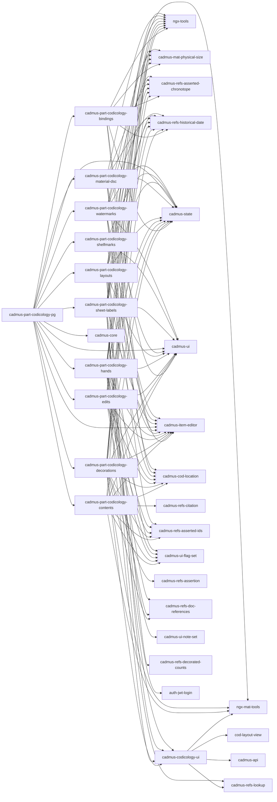

# Cadmus Codicology Shell

This project was generated using [Angular CLI](https://github.com/angular/angular-cli) version 20.0.0.

The project is used as an incubator shell for developing and testing frontend Cadmus codicological components:

- [backend models](https://github.com/vedph/cadmus-codicology)
- [API](https://github.com/vedph/cadmus-codicology-api)

Per-library documentation:

- [codicology UI library](projects/myrmidon/cadmus-codicology-ui/README.md)

🐋 Quick **Docker image** build:

1. `pnpm run build-lib`; if you are going to use the libraries, publish them via `publish.bat`;
2. remember to update version in `env.js`, then `ng build --configuration production`;
3. `docker build . -t vedph2020/cadmus-codicology-shell:14.0.1 -t vedph2020/cadmus-codicology-shell:latest` (replace with the current version).

## Shell Architecture

- each part is a library named after it following the pattern `cadmus-part-codicology-<PARTNAME>`.
- a pages library `cadmus-part-codicology-pg` imports all these libraries and provides routing: `ng g library @myrmidon/cadmus-part-codicology-pg --prefix cadmus`.

This workspace was setup as follows:

```sh
ng new cadmus-codicology-shell
cd cadmus-codicology-shell
ng add @angular/material
ng add @angular/localize

ng g library @myrmidon/cadmus-codicology-ui --prefix cadmus --force
ng g library @myrmidon/cadmus-part-codicology-bindings --prefix cadmus --force
ng g library @myrmidon/cadmus-part-codicology-contents --prefix cadmus --force
ng g library @myrmidon/cadmus-part-codicology-decorations --prefix cadmus --force
ng g library @myrmidon/cadmus-part-codicology-edits --prefix cadmus --force
ng g library @myrmidon/cadmus-part-codicology-hands --prefix cadmus --force
ng g library @myrmidon/cadmus-part-codicology-layouts --prefix cadmus --force
ng g library @myrmidon/cadmus-part-codicology-material-dsc --prefix cadmus --force
ng g library @myrmidon/cadmus-part-codicology-sheet-labels --prefix cadmus --force
ng g library @myrmidon/cadmus-part-codicology-shelfmarks --prefix cadmus --force
ng g library @myrmidon/cadmus-part-codicology-watermarks --prefix cadmus --force
ng g library @myrmidon/cadmus-part-codicology-pg --prefix cadmus --force
```

## Libraries


```mermaid
graph LR;
  cadmus-codicology-ui --> ngx-mat-tools
  cadmus-codicology-ui --> cod-layout-view
  cadmus-codicology-ui --> cadmus-refs-lookup
  cadmus-codicology-ui --> cadmus-api
  cadmus-part-codicology-bindings --> ngx-tools
  cadmus-part-codicology-bindings --> cadmus-mat-physical-size
  cadmus-part-codicology-bindings --> cadmus-refs-asserted-chronotope
  cadmus-part-codicology-bindings --> cadmus-refs-historical-date
  cadmus-part-codicology-bindings --> cadmus-state
  cadmus-part-codicology-bindings --> cadmus-ui
  cadmus-part-codicology-bindings --> cadmus-item-editor
  cadmus-part-codicology-contents --> ngx-tools
  cadmus-part-codicology-contents --> ngx-mat-tools
  cadmus-part-codicology-contents --> cadmus-cod-location
  cadmus-part-codicology-contents --> cadmus-refs-citation
  cadmus-part-codicology-contents --> cadmus-refs-asserted-ids
  cadmus-part-codicology-contents --> cadmus-ui-flag-set
  cadmus-part-codicology-contents --> cadmus-state
  cadmus-part-codicology-contents --> cadmus-ui
  cadmus-part-codicology-contents --> cadmus-item-editor
  cadmus-part-codicology-decorations --> ngx-tools
  cadmus-part-codicology-decorations --> ngx-mat-tools
  cadmus-part-codicology-decorations --> cadmus-refs-assertion
  cadmus-part-codicology-decorations --> cadmus-mat-physical-size
  cadmus-part-codicology-decorations --> cadmus-refs-asserted-chronotope
  cadmus-part-codicology-decorations --> cadmus-refs-asserted-ids
  cadmus-part-codicology-decorations --> cadmus-refs-doc-references
  cadmus-part-codicology-decorations --> cadmus-refs-historical-date
  cadmus-part-codicology-decorations --> cadmus-cod-location
  cadmus-part-codicology-decorations --> cadmus-ui-flag-set
  cadmus-part-codicology-decorations --> cadmus-state
  cadmus-part-codicology-decorations --> cadmus-ui
  cadmus-part-codicology-decorations --> cadmus-item-editor
  cadmus-part-codicology-decorations --> cadmus-codicology-ui
  cadmus-part-codicology-edits --> ngx-tools
  cadmus-part-codicology-edits --> cadmus-cod-location
  cadmus-part-codicology-edits --> cadmus-refs-asserted-ids
  cadmus-part-codicology-edits --> cadmus-refs-doc-references
  cadmus-part-codicology-edits --> cadmus-refs-historical-date
  cadmus-part-codicology-edits --> cadmus-ui-flag-set
  cadmus-part-codicology-edits --> cadmus-state
  cadmus-part-codicology-edits --> cadmus-ui
  cadmus-part-codicology-edits --> cadmus-item-editor
  cadmus-part-codicology-hands --> ngx-tools
  cadmus-part-codicology-hands --> cadmus-cod-location
  cadmus-part-codicology-hands --> cadmus-mat-physical-size
  cadmus-part-codicology-hands --> cadmus-refs-asserted-chronotope
  cadmus-part-codicology-hands --> cadmus-refs-asserted-ids
  cadmus-part-codicology-hands --> cadmus-refs-doc-references
  cadmus-part-codicology-hands --> cadmus-refs-historical-date
  cadmus-part-codicology-hands --> cadmus-ui-flag-set
  cadmus-part-codicology-hands --> cadmus-ui-note-set
  cadmus-part-codicology-hands --> cadmus-state
  cadmus-part-codicology-hands --> cadmus-ui
  cadmus-part-codicology-hands --> cadmus-item-editor
  cadmus-part-codicology-hands --> cadmus-codicology-ui
  cadmus-part-codicology-layouts --> ngx-tools
  cadmus-part-codicology-layouts --> cadmus-cod-location
  cadmus-part-codicology-layouts --> cadmus-mat-physical-size
  cadmus-part-codicology-layouts --> cadmus-refs-asserted-chronotope
  cadmus-part-codicology-layouts --> cadmus-refs-decorated-counts
  cadmus-part-codicology-layouts --> cadmus-refs-historical-date
  cadmus-part-codicology-layouts --> cadmus-state
  cadmus-part-codicology-layouts --> cadmus-ui
  cadmus-part-codicology-layouts --> cadmus-item-editor
  cadmus-part-codicology-layouts --> cadmus-codicology-ui
  cadmus-part-codicology-material-dsc --> ngx-tools
  cadmus-part-codicology-material-dsc --> cadmus-cod-location
  cadmus-part-codicology-material-dsc --> cadmus-refs-asserted-chronotope
  cadmus-part-codicology-material-dsc --> cadmus-refs-historical-date
  cadmus-part-codicology-material-dsc --> cadmus-state
  cadmus-part-codicology-material-dsc --> cadmus-ui
  cadmus-part-codicology-material-dsc --> cadmus-item-editor
  cadmus-part-codicology-pg --> cadmus-core
  cadmus-part-codicology-pg --> cadmus-state
  cadmus-part-codicology-pg --> cadmus-ui
  cadmus-part-codicology-pg --> cadmus-item-editor
  cadmus-part-codicology-pg --> cadmus-part-codicology-bindings
  cadmus-part-codicology-pg --> cadmus-part-codicology-contents
  cadmus-part-codicology-pg --> cadmus-part-codicology-decorations
  cadmus-part-codicology-pg --> cadmus-part-codicology-edits
  cadmus-part-codicology-pg --> cadmus-part-codicology-hands
  cadmus-part-codicology-pg --> cadmus-part-codicology-layouts
  cadmus-part-codicology-pg --> cadmus-part-codicology-material-dsc
  cadmus-part-codicology-pg --> cadmus-part-codicology-sheet-labels
  cadmus-part-codicology-pg --> cadmus-part-codicology-shelfmarks
  cadmus-part-codicology-pg --> cadmus-part-codicology-watermarks
  cadmus-part-codicology-sheet-labels --> ngx-tools
  cadmus-part-codicology-sheet-labels --> ngx-mat-tools
  cadmus-part-codicology-sheet-labels --> auth-jwt-login
  cadmus-part-codicology-sheet-labels --> cadmus-mat-physical-size
  cadmus-part-codicology-sheet-labels --> cadmus-refs-asserted-chronotope
  cadmus-part-codicology-sheet-labels --> cadmus-refs-historical-date
  cadmus-part-codicology-sheet-labels --> cadmus-ui-flag-set
  cadmus-part-codicology-sheet-labels --> cadmus-refs-lookup
  cadmus-part-codicology-sheet-labels --> cadmus-state
  cadmus-part-codicology-sheet-labels --> cadmus-ui
  cadmus-part-codicology-sheet-labels --> cadmus-item-editor
  cadmus-part-codicology-sheet-labels --> cadmus-codicology-ui
  cadmus-part-codicology-shelfmarks --> cadmus-state
  cadmus-part-codicology-shelfmarks --> cadmus-ui
  cadmus-part-codicology-shelfmarks --> cadmus-item-editor
  cadmus-part-codicology-watermarks --> cadmus-cod-location
  cadmus-part-codicology-watermarks --> cadmus-mat-physical-size
  cadmus-part-codicology-watermarks --> cadmus-refs-asserted-chronotope
  cadmus-part-codicology-watermarks --> cadmus-refs-asserted-ids
  cadmus-part-codicology-watermarks --> cadmus-refs-historical-date
  cadmus-part-codicology-watermarks --> cadmus-state
  cadmus-part-codicology-watermarks --> cadmus-ui
  cadmus-part-codicology-watermarks --> cadmus-item-editor
```
