# Cadmus Codicology Shell

This project was generated using [Angular CLI](https://github.com/angular/angular-cli) version 19.0.6.

The project is used as an incubator shell for developing and testing frontend Cadmus codicological components:

- [backend models](https://github.com/vedph/cadmus-codicology)
- [API](https://github.com/vedph/cadmus-codicology-api)

Per-library documentation:

- [codicology UI library](projects/myrmidon/cadmus-codicology-ui/README.md)

🐋 Quick Docker image build:

1. `npm run build-lib`; if you are going to use the libraries, publish them via `publish.bat`;
2. remember to update version in `env.js`, then `ng build --configuration production`;
3. `docker build . -t vedph2020/cadmus-codicology-shell:10.0.0 -t vedph2020/cadmus-codicology-shell:latest` (replace with the current version).

## Shell Architecture

- each part is a library named after it following the pattern `cadmus-part-codicology-<PARTNAME>`.
- a pages library `cadmus-part-codicology-pg` imports all these libraries and provides routing: `ng g library @myrmidon/cadmus-part-codicology-pg --prefix cadmus`.

This workspace was setup as follows:

```sh
ng new cadmus-codicology-shell
cd cadmus-codicology-shell
ng add @angular/material
ng add @angular/localize

ng g library @myrmidon/cadmus-codicology-ui --prefix cadmus --force
ng g library @myrmidon/cadmus-part-codicology-bindings --prefix cadmus --force
ng g library @myrmidon/cadmus-part-codicology-contents --prefix cadmus --force
ng g library @myrmidon/cadmus-part-codicology-decorations --prefix cadmus --force
ng g library @myrmidon/cadmus-part-codicology-edits --prefix cadmus --force
ng g library @myrmidon/cadmus-part-codicology-hands --prefix cadmus --force
ng g library @myrmidon/cadmus-part-codicology-layouts --prefix cadmus --force
ng g library @myrmidon/cadmus-part-codicology-material-dsc --prefix cadmus --force
ng g library @myrmidon/cadmus-part-codicology-sheet-labels --prefix cadmus --force
ng g library @myrmidon/cadmus-part-codicology-shelfmarks --prefix cadmus --force
ng g library @myrmidon/cadmus-part-codicology-watermarks --prefix cadmus --force
ng g library @myrmidon/cadmus-part-codicology-pg --prefix cadmus --force
```

## Libraries

```mermaid
graph LR;
  cadmus-codicology-ui --> ngx-mat-tools
  cadmus-codicology-ui --> cadmus-refs-lookup
  cadmus-codicology-ui --> cadmus-api
  cadmus-part-codicology-bindings --> ngx-tools
  cadmus-part-codicology-bindings --> cadmus-mat-physical-size
  cadmus-part-codicology-bindings --> cadmus-refs-asserted-chronotope
  cadmus-part-codicology-bindings --> cadmus-refs-historical-date
  cadmus-part-codicology-bindings --> cadmus-state
  cadmus-part-codicology-bindings --> cadmus-ui
  cadmus-part-codicology-bindings --> cadmus-ui-pg
  cadmus-part-codicology-contents --> ngx-tools
  cadmus-part-codicology-contents --> ngx-mat-tools
  cadmus-part-codicology-contents --> cadmus-cod-location
  cadmus-part-codicology-contents --> cadmus-refs-asserted-ids
  cadmus-part-codicology-contents --> cadmus-ui-flag-set
  cadmus-part-codicology-contents --> cadmus-state
  cadmus-part-codicology-contents --> cadmus-ui
  cadmus-part-codicology-contents --> cadmus-ui-pg
  cadmus-part-codicology-decorations --> ngx-tools
  cadmus-part-codicology-decorations --> ngx-mat-tools
  cadmus-part-codicology-decorations --> cadmus-refs-assertion
  cadmus-part-codicology-decorations --> cadmus-mat-physical-size
  cadmus-part-codicology-decorations --> cadmus-refs-asserted-chronotope
  cadmus-part-codicology-decorations --> cadmus-refs-asserted-ids
  cadmus-part-codicology-decorations --> cadmus-refs-doc-references
  cadmus-part-codicology-decorations --> cadmus-refs-historical-date
  cadmus-part-codicology-decorations --> cadmus-cod-location
  cadmus-part-codicology-decorations --> cadmus-ui-flag-set
  cadmus-part-codicology-decorations --> cadmus-state
  cadmus-part-codicology-decorations --> cadmus-ui
  cadmus-part-codicology-decorations --> cadmus-ui-pg
  cadmus-part-codicology-decorations --> cadmus-codicology-ui
  cadmus-part-codicology-edits --> ngx-tools
  cadmus-part-codicology-edits --> cadmus-cod-location
  cadmus-part-codicology-edits --> cadmus-refs-asserted-ids
  cadmus-part-codicology-edits --> cadmus-refs-doc-references
  cadmus-part-codicology-edits --> cadmus-refs-historical-date
  cadmus-part-codicology-edits --> cadmus-ui-flag-set
  cadmus-part-codicology-edits --> cadmus-state
  cadmus-part-codicology-edits --> cadmus-ui
  cadmus-part-codicology-edits --> cadmus-ui-pg
  cadmus-part-codicology-hands --> ngx-tools
  cadmus-part-codicology-hands --> cadmus-cod-location
  cadmus-part-codicology-hands --> cadmus-mat-physical-size
  cadmus-part-codicology-hands --> cadmus-refs-asserted-chronotope
  cadmus-part-codicology-hands --> cadmus-refs-asserted-ids
  cadmus-part-codicology-hands --> cadmus-refs-doc-references
  cadmus-part-codicology-hands --> cadmus-refs-historical-date
  cadmus-part-codicology-hands --> cadmus-ui-flag-set
  cadmus-part-codicology-hands --> cadmus-ui-note-set
  cadmus-part-codicology-hands --> cadmus-state
  cadmus-part-codicology-hands --> cadmus-ui
  cadmus-part-codicology-hands --> cadmus-ui-pg
  cadmus-part-codicology-hands --> cadmus-codicology-ui
  cadmus-part-codicology-layouts --> ngx-tools
  cadmus-part-codicology-layouts --> cadmus-cod-location
  cadmus-part-codicology-layouts --> cadmus-mat-physical-size
  cadmus-part-codicology-layouts --> cadmus-refs-asserted-chronotope
  cadmus-part-codicology-layouts --> cadmus-refs-decorated-counts
  cadmus-part-codicology-layouts --> cadmus-refs-historical-date
  cadmus-part-codicology-layouts --> cadmus-state
  cadmus-part-codicology-layouts --> cadmus-ui
  cadmus-part-codicology-layouts --> cadmus-ui-pg
  cadmus-part-codicology-layouts --> cadmus-codicology-ui
  cadmus-part-codicology-material-dsc --> ngx-tools
  cadmus-part-codicology-material-dsc --> cadmus-cod-location
  cadmus-part-codicology-material-dsc --> cadmus-refs-asserted-chronotope
  cadmus-part-codicology-material-dsc --> cadmus-refs-historical-date
  cadmus-part-codicology-material-dsc --> cadmus-state
  cadmus-part-codicology-material-dsc --> cadmus-ui
  cadmus-part-codicology-material-dsc --> cadmus-ui-pg
  cadmus-part-codicology-pg --> cadmus-core
  cadmus-part-codicology-pg --> cadmus-state
  cadmus-part-codicology-pg --> cadmus-ui
  cadmus-part-codicology-pg --> cadmus-ui-pg
  cadmus-part-codicology-pg --> cadmus-part-codicology-bindings
  cadmus-part-codicology-pg --> cadmus-part-codicology-contents
  cadmus-part-codicology-pg --> cadmus-part-codicology-decorations
  cadmus-part-codicology-pg --> cadmus-part-codicology-edits
  cadmus-part-codicology-pg --> cadmus-part-codicology-hands
  cadmus-part-codicology-pg --> cadmus-part-codicology-layouts
  cadmus-part-codicology-pg --> cadmus-part-codicology-material-dsc
  cadmus-part-codicology-pg --> cadmus-part-codicology-sheet-labels
  cadmus-part-codicology-pg --> cadmus-part-codicology-shelfmarks
  cadmus-part-codicology-pg --> cadmus-part-codicology-watermarks
  cadmus-part-codicology-sheet-labels --> ngx-tools
  cadmus-part-codicology-sheet-labels --> ngx-mat-tools
  cadmus-part-codicology-sheet-labels --> auth-jwt-login
  cadmus-part-codicology-sheet-labels --> cadmus-mat-physical-size
  cadmus-part-codicology-sheet-labels --> cadmus-refs-asserted-chronotope
  cadmus-part-codicology-sheet-labels --> cadmus-refs-historical-date
  cadmus-part-codicology-sheet-labels --> cadmus-ui-flag-set
  cadmus-part-codicology-sheet-labels --> cadmus-refs-lookup
  cadmus-part-codicology-sheet-labels --> cadmus-state
  cadmus-part-codicology-sheet-labels --> cadmus-ui
  cadmus-part-codicology-sheet-labels --> cadmus-ui-pg
  cadmus-part-codicology-sheet-labels --> cadmus-codicology-ui
  cadmus-part-codicology-shelfmarks --> cadmus-state
  cadmus-part-codicology-shelfmarks --> cadmus-ui
  cadmus-part-codicology-shelfmarks --> cadmus-ui-pg
  cadmus-part-codicology-watermarks --> cadmus-cod-location
  cadmus-part-codicology-watermarks --> cadmus-mat-physical-size
  cadmus-part-codicology-watermarks --> cadmus-refs-asserted-chronotope
  cadmus-part-codicology-watermarks --> cadmus-refs-asserted-ids
  cadmus-part-codicology-watermarks --> cadmus-refs-historical-date
  cadmus-part-codicology-watermarks --> cadmus-state
  cadmus-part-codicology-watermarks --> cadmus-ui
  cadmus-part-codicology-watermarks --> cadmus-ui-pg
```



## History

- 2025-03-11: changes to models and corresponding UI for:
  - `CodDecorationElement`: ➕ add `tag` (`string`, optional thesaurus 📚 `cod-decoration-element-tags`).
  - `CodWatermark`:
    - ➕ add `rangesAsQuire` checkbox (`boolean`) meaning that `ranges` refers to quires rather than sheets.
    - UI: make sample not required.
  - `CodContent`: ➕ add `claimedAuthorRanges` (`CodLocationRange[]`) and `claimedTitleRanges` (`CodLocationRange[]`) for ranges referring to claimed author and claimed work.
  - `CodContentAnnotation`:
    - ➕ add `features` (`string[]`, flags) with its thesaurus 📚 `cod-content-annotation-features`.
    - ➕ add `languages` (`string[]`, flags) with its thesaurus 📚 `cod-content-annotation-languages`.

- 2025-03-09:
  - ⚠️ breaking change because of migration to Cadmus shell V12.
  - updated Angular and packages.

### 10.0.1

- 2025-01-25: ⚠️ migrated to signals.

### 10.0.0

- 2025-01-10: updated Angular and packages.
- 2025-01-04: ⚠️ updated [Cadmus dependencies](https://github.com/vedph/cadmus-shell-v3) to version 11 (standalone components).

### 9.0.0

- 2025-01-02:
  - ⚠️ standalone components.
  - refactored shell for modern Angular.

### 8.1.0

- 2024-12-26: ⚠️ updated to bricks V3.
- 2024-12-18:
  - updated Angular and packages.
  - removed legacy M2 themes.

### 8.0.0

- 2024-12-06: ⚠️ updated core dependencies.

### 7.0.0

- 2024-11-22: ⚠️ upgraded to Angular 19.
- 2024-11-18: updated Angular and packages.

### 6.1.3

- 2024-10-15: updated Angular and packages.

### 6.1.2

- 2024-06-26: updated Angular and packages.

### 6.1.1

- 2024-06-09:
  - updated Angular and packages.
  - added `class="mat-X"` for each `color="X"` (e.g. `class="mat-primary"` wherever there is a `color="primary"`) to allow transitioning to Angular Material M3 from M2. This also implies adding it directly to the target element, so in the case of `mat-icon` inside a `button` with `color` the class is added to `mat-icon` directly (unless the button too has the same color). This allows to keep the old M2 clients while using the new M3, because it seems that the compatibility mixin is not effective in some cases like inheritance of `color`, and in the future `color` will be replaced by `class` altogether.
  - updated to modern control flow syntax.
  - applied [M3 theme](https://material.angular.io/guide/theming).

### 6.1.0

- 2024-05-24: ⚠️ upgraded to Angular 18. All libraries versions bumped to 6.1.0.
- 2024-04-13:
  - updated Angular.
  - ⚠️ migrated to [bricks V2](https://github.com/vedph/cadmus-bricks-shell-v2), major **version** of all libraries bumped to 6.
- 2023-11-18: updated Angular.
- 2023-11-09: ⚠️ upgraded to Angular 17.

### 5.1.0

- 2023-08-28: updated Angular and packages.
- 2023-07-30: added `workId` to `CodContent` (`@myrmidon/cadmus-part-codicology-contents` 3.1.1).
- 2023-07-24:
  - added `authorIds` to `CodEdit`.
  - updated Angular.
- 2023-07-17:
  - updated packages.
  - set internal link as default for decoration artist ID.
  - added `ids` to hand.
- 2023-06-22:
  - default unit=`mm` for watermarks and bindings.
  - fixed preset script in new hand instance.

### 5.0.0

- 2023-06-17:
  - updated Angular and packages.
  - moved to PostgreSQL.

### 4.0.0

- 2023-05-24: breaking changes in two parts:
  - watermarks, `ids` property: replaced type `AssertedId[]` with `AssertedCompositeId[]`.
  - decorations, `artist.ids` property: replaced type `AssertedId[]` with `AssertedCompositeId[]`.

### 3.2.0

- 2023-05-17:
  - CodWatermark: changed chronotope in chronotopes.
  - CodContentAnnotation: added note; explicit and text not required.
  - CodEdit: added has-date control so that users are allowed to omit date.
- 2023-05-11: updated to Angular 16.
- 2023-04-21: updated Angular and packages.

### 3.1.0

- 2023-03-25:
  - updated Angular and packages.
  - changed hand instance's `script` to `scripts`.
  - added `isByScript` to the N-col definition model.
- 2023-02-13: fixes to decoration flags.

### 3.0.15

- 2023-02-11: fixes to hand instance editor.
- 2023-02-10: fixes to decorations.

### 3.0.14

- 2023-02-10: updated flags related editors.

### 3.0.13

- 2023-02-10: refactored flags related editors.
- 2023-02-09: completed property bindings refactoring.

### 3.0.12

- 2023-02-08:
  - ranges instead of single range for hand's subscription.
  - removed all the no more required `initial...` property bindings (essentially referred to bricks: references, chronotope, size, cod.location): bindings (binding editor), contents (content annotation, content editor), decorations (decoration, artist style, element), edits (edit), hands (hand, hand instance, hand sign), layouts (layout), material-dsc (palimpsest, unit), sheet labels (endleaf, N-col definition), watermarks (watermark).
- 2023-02-07: updated packages.
- 2023-02-03: updated packages.

### 3.0.11

- 2023-02-03: updated bricks packages (updating decorations and watermarks).

### 3.0.10

- 2023-02-03:
  - updated Angular and packages.
  - improved input/output bindings of submodel editors.
- 2023-02-02: allow `n` as system ID in location converter.
- 2023-01-24: updated packages.

### 3.0.9

- 2023-01-24: fixed button label in edit editor.
- 2023-01-23: r/v for covers in sheet labels.

### 3.0.8

- 2023-01-23:
  - updated packages (cover in `CodLocation`).
  - added covers in sheet labels.
- 2023-01-20: updated packages.

### 3.0.7

- 2023-01-14: fix to decoration element editor (do not emit on `type` value change).
- 2023-01-12: fix to decoration element editor, also moving it to an expander from a nested tab (`@myrmidon/cadmus-part-codicology-decorations`).

### 3.0.6

- 2023-01-12:
  - sheet labels: new formula for setting values of an arbitrary cells set.
- 2023-01-11:
  - layout figure: added explode feature.
  - sheet labels: changed add formula behavior (label generator) so that r/v suffixes are added (e.g. `1*3=10` = `10r`, `10v`, `11r`).
- 2022-12-21: fix typologies thesaurus not bound in decorations (`@myrmidon/cadmus-part-codicology-decorations`).
- 2022-12-20: fix to flags not updated when loading decoration element (`@myrmidon/cadmus-part-codicology-decorations`).
- 2022-12-19:
  - updated Angular.
  - fix to parent keys not updated when loading/deleting elements in decoration editor (`@myrmidon/cadmus-part-codicology-decorations`).
- 2022-12-15: version numbers updates for aesthetic changes.

### 3.0.5

- 2022-12-15: updated Cadmus packages for fixes.
- 2022-12-14:
  - updated Angular and packages.
  - minor fixes to add buttons in contents and layouts.

### 3.0.4

- 2022-12-06: fixed chronotope not reset in hand instance editor.

### 3.0.3

- 2022-12-06:
  - updated packages.
  - fixed codicology instance not reset properly on new instance.

### 3.0.2

- 2022-12-03:
  - fixes to button styles.
  - changed code template for editing multiple entries in an array. See below.
- 2022-12-02: updated packages.

New template:

```ts
  public add__NAME__(): void {
    this.edit__NAME__({});
  }

  public edit__NAME__(entry: __NAME__ | null, index = -1): void {
    if (!entry) {
      this.editedEntryIndex = -1;
      this.editedEntry = undefined;
    } else {
      this.editedEntryIndex = index;
      this.editedEntry = entry;
    }
  }

  public on__NAME__Save(entry: __NAME__): void {
    const __NAME__s = [...this.__NAME__s.value];
    if (this.editedEntryIndex > -1) {
      __NAME__s.splice(this.editedEntryIndex, 1, entry);
    } else {
      __NAME__s.push(entry);
    }

    this.__NAME__s.setValue(__NAME__s);
    this.__NAME__s.updateValueAndValidity();
    this.__NAME__s.markAsDirty();
    this.edit__NAME__(null);
  }

  public delete__NAME__(index: number): void {
    this._dialogService
      .confirm('Confirmation', 'Delete __NAME__?')
      .pipe(take(1))
      .subscribe((yes) => {
        if (yes) {
          const __NAME__s = [...this.__NAME__s.value];
          __NAME__s.splice(index, 1);
          this.__NAME__s.setValue(__NAME__s);
          this.__NAME__s.updateValueAndValidity();
          this.__NAME__s.markAsDirty();
        }
      });
  }
```

### 3.0.1

- 2022-12-01: updated packages.
- 2022-11-30:
  - updated packages after removing `@angular/flex-layout` from Cadmus shell.
  - removed usages of Angular Flex Layout from `@myrmidon/cadmus-part-codicology-sheet-labels`.
  - fix to `@myrmidon/cadmus-part-codicology-contents` (still using `CadmusValidators`).

### 3.0.0

- 2022-11-23: moved note set from `@myrmidon/cadmus-codicology-ui` to Cadmus bricks.
- 2022-11-22:
  - upgraded to Angular 15
  - replaced Akita with ELF
  - all libraries version numbers bumped to 2.0.0
- 2022-11-11:
  - fix to layout editor (counts not loaded: `@myrmidon/cadmus-part-codicology-layouts`).
  - fix to hand instance editor (`@myrmidon/cadmus-part-codicology-hands`).
- 2022-11-03: updated Angular and Cadmus packages.

### 2.0.5

- 2022-11-10: updated Angular.
- 2022-09-24:
  - updated Angular and Cadmus packages.
  - fix to decoration element editor (`cadmus-part-codicology-decorations`).
  - set required for hands instance ranges control (`cadmus-part-codicology-hands`).
  - aesthetic changes in layout editor (`cadmus-part-codicology-layouts`).

### 2.0.4

- 2022-09-15: updated Angular and Cadmus packages.

### 2.0.3

- 2022-08-05: fixes to decoration.
- 2022-08-04:
  - fix to sheet labels definition editing
  - fix to layouts decorated counts thesauri

### 2.0.2

- 2022-08-04: replaced external ID with asserted ID removing dependency from `@myrmidon/cadmus-refs-external-ids`.
- 2022-08-03: minor fixes and version bump for all the libraries.

### 2.0.1

- 2022-07-23: changed `CodContent` model by adding `author` and changing `range` to `ranges`.
- 2022-07-21: fixes and updates.

### 2.0.0

- 2022-06-19: upgraded to Angular 14 refactoring all the forms into typed.
- 2022-05-21: fixed colors and gildings thesauri in decorations part.

### 1.0.7

- 2022-05-05: updated packages and fixed locale issue.

### 1.0.6

- 2022-04-29: upgraded Angular.

### 1.0.5

- 2022-04-08: various fixes to decorations and labels, additions to ui.
- 2022-04-05: various fixes.

### 1.0.4

- 2022-03-26: various fixes.

### 1.0.3

- 2022-03-23: various fixes, added layout formula.

### 1.0.2

- 2022-03-22: various fixes.
- 2022-03-20: upgraded Cadmus shell packages.

### 1.0.1

- 2022-03-18: fixes to part editors; upgraded Angular.
- 2022-03-05: fixes to images editor in UI library; upgraded Angular.

### 1.0.0

- updated Docker scripts.
